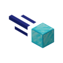

<div align="center">
  
  <h1>Meteor Orbiter</h1>
  <p>An addon for <a href="https://meteorclient.com/">Meteor Client</a> that adds 60+ modules, custom commands, and HUD elements for anarchy, griefing, and quality of life.</p>

  
  <a href="https://github.com/player19425/Meteor-Orbiter/releases"></a>
  
  
  <a href="https://github.com/player19425/Meteor-Orbiter/releases"></a>
  <a href="https://github.com/player19425/Meteor-Orbiter/stargazers"></a>
  <a href="https://github.com/player19425/Meteor-Orbiter/commits/26.2"></a>
  
  
  
</div>

<hr />

# About

Orbiter is a collection of modules and tools for [Meteor Client](https://meteorclient.com/), originally built for survival, anarchy, and creative/OP.

Everything is organized into four in-game categories:

- **Orbiter Survival** • general purpose and anti-abuse modules
- **Orbiter Vanilla** • modules that only use vanilla mechanics
- **Orbiter Creative/OP** • modules that require Creative mode or operator permissions
- **Orbiter Stupid** • joke / experimental modules

# Requirements

- [Java](https://adoptium.net/temurin/releases) 25 or higher
- [Fabric Loader](https://fabricmc.net/use/installer/) 0.19.3+
- [Meteor Client](https://meteorclient.com/) for 26.2

# Installation

1. Download the latest [release](https://github.com/player19425/Meteor-Orbiter/releases) of the mod.
2. Put the `.jar` in your `.minecraft/mods` folder. (varies depending on launcher)
3. Launch the game with Fabric and Meteor Client installed.
4. It should be properly installed by now.

# Modules:

## Combat:

| Module | Description |
|---|---|
| **Aim Assist Plus** | Smooth aim assist with separate yaw/pitch speeds and filters. |
| **Anti Knockback** | Handles knockback only. |
| **Bow Assist** | Aims the bow with accurate projectile physics, movement prediction, and auto-fire support. |
| **Crossbow Assist** | Aims a loaded crossbow with projectile physics, movement prediction, and auto-fire. |
| **Mace Assist** | Auto-aim and strike with the Mace, including Elytra swapping for critical hits on landing. |
| **No Friend Hit** | Prevents attacking Meteor friends. |
| **Out Of Reach** | Aggressively teleports you outside player reach using gamemode detection and movement prediction. |
| **Precision Shot** | Predicts projectile trajectories and silently aims at the targeted block or entity via server packets (active by default). |
| **Shield Assist** | Auto-blocks with a shield against projectiles, melee, and special attacks, with smart release for counter-attacks. |
| **Spear Assist** | Jab and charge attack control with smart mode switching. |
| **Trident Assist** | Manual or automatic trident throwing and melee combat. |

## Movement:

| Module | Description |
|---|---|
| **Anti Push** | Stops fluid and entity push only. |
| **Auto Clutch** | Automatically clutches to prevent fall damage using blocks, boats, water, or any fall-canceling item. |
| **Force Invisibility** | Spoofs server Y and only drops to real Y when needed. |
| **Jump A** | Jump over walls or reach blocks you're looking at with calculated velocity. Configurable scan height up to 256 with an optional unlimited mode. |
| **Slime Jump** | Automatically bounce when standing on slime, with configurable timing, velocity, and a fixed bounce counter. |

## Player:

| Module | Description |
|---|---|
| **Auto Craft Plus** | Automatically crafts items at max speed. Configure the recipe, enable, and watch it go. |
| **Client Side Mine** | Instantly breaks blocks client-side with anti-rubber-band to stay in the hole you dug. |
| **Restock** | Fast hotbar restocking from inventory first, then open storage GUIs. |

## World:

| Module | Description |
|---|---|
| **Auto Farming** | Harvests crops/cactus/sugarcane/bamboo, breeds animals, applies bonemeal and replants with delay. |
| **Command Block Placer** | Places command blocks with set commands and dynamic command slots (1-100). Requires Creative + OP. |
| **Control Player** | Uses owner-authorized OP commands to rotate selected players around you. |
| **Entity Spammer** | Mega entity manipulation module: spawn, fill, animate, and dominate entities. OP required. |
| **Item Creator** | Create custom items with names, enchants, attributes, and entity NBT. Creative only. |
| **Item Generator** | Spawns random or specific items with optional random enchants/attributes. Requires Creative mode. |
| **NBT Lectern Crasher** | Places lecterns with malicious books. Payloads are sanitized to avoid self-kicks. |
| **Operator Nuker** | Nuke blocks using /fill or /setblock commands. Only acts when non-air blocks are present. Requires OP permissions. |
| **RNG Spammer** | Spawns valid loot tables around selected players. OP required. |
| **TNT Rain** | Spawns TNT falling from the sky in a radius with random motion/rotation and configurable continuous rate. OP required. |
| **UUID Ban** | Ban a player by summoning an entity carrying their UUID. Uses the entity's spawn egg when available. |
| **World Downloader** | Downloads the world around you while moving. |
| **World Edit** | Expanded client-side WorldEdit using vanilla commands. Chat: `.we <command>` |
| **World Eraser** | Erases blocks in a radius. Enable TWICE within 10s to trigger. OP permissions required. |

## Render:

| Module | Description |
|---|---|
| **Beacon Optimizer** | Reduces beacon animation-state churn without hiding visible beacon beams. |
| **Block Spoof** | Replace block textures/models client-side for visual deception. Block maps accept any separator. |
| **Bossbar Flash** | Rapidly creates/updates boss bars with random colors and titles. OP required. |
| **Camera 360** | Removes camera rotation limits for full 360°+ movement while sending only legal rotations to the server. |
| **Firework Show** | Launch choreographed firework shows with customizable shapes, colors, and patterns. |
| **Particle Control** | Creates optimized rotating particle shapes around selected players with OP /particle commands. |
| **Particle Spam** | Spams /particle commands in a radius. OP required. |
| **Playsound Spam** | Spams every sound in the game via /playsound. OP required. |
| **View Blocks** | ESP for invisible and custom blocks with chunk-based scanning. |

## Misc:

| Module | Description |
|---|---|
| **Actions** | Reactive trigger/action system with module toggles, commands, chat, disconnect, and conditional logic. |
| **Anti Staff** | Detects staff, watched players, and spectators via tab, chat, proximity. Auto-leaves, sends commands, toggles modules. |
| **Auto Find** | Scan for stashes, bases, and storage. World-wrapping flight scanner. |
| **Auto Shop** | Runs the server shop sequence and deposits purchased items into nearby chests. |
| **Client Side Things** | Local visual spoof system for HUD, inventory, weather, equipment, overlays, fog, crosshair, and bossbar. |
| **Exploit Preventer** | Prevents common server-side exploits: brand fingerprinting, resource pack SSRF, and channel fingerprinting. |
| **I Sell Wand** | Automates selling by equipping a sell wand and right-clicking recorded/nearby chests. |
| **Infini Reach** | Extended reach via OP attributes or an invisible offhand item. Restores the original values when disabled. |
| **Item Info** | Adds client-side-only lore to item tooltips: durability, enchantments, components, and full NBT. |
| **Item Stealer** | Clone items with pick-block (no server packet), bypass trades, auto-steal GUIs, and persist items to disk. |
| **Leave Message** | Intercepts close events, sends leave chat, waits, then disconnects gracefully. |
| **Message Formatter** | Formats outgoing chat with color codes, gradients, font presets, Zalgo, and character injection. Supports prefix/suffix, commands with spaces, and safe 256-char truncation. |
| **Peak Plugin Scanner** | Detects server plugins via command tree analysis, systematic probing, namespace/help probing, and channel fingerprinting. Includes per-server caching and probe retries. |
| **Ping Spoof** | Advanced ping/movement spoof with bypass, spoof, adaptive, competitive, and dynamic adaptive modes. |
| **Server Protect** | Comprehensive anti-abuse module. Blocks crash packets, entity spam, malicious items, and more. |
| **Spam Plus** | Spam module with letter-ladder, auto-split, command prefix/suffix, start delay, and randomized delays. |

# Commands:

| Command | Description | Aliases |
|---|---|---|
| `.autoshop` | Toggle and control the AutoShop module. | `autoshopdetect` |
| `.escape` | Controls ForceInvisibility escape logic. | |
| `.exportmodulelist` | Exports all module names to clipboard. | |
| `.fixdeath` | Stops fake death loops and force-resyncs client/server state. | |
| `.givepresetitems` | 200+ OP and command-block-only presets. | `gpi` |
| `.hidekeybind` | Hides Meteor keybinds from the Controls screen. | |
| `.isellwand` | Control the ISellWand module. | `sellwand` |
| `.itemcrash` | Overloads your held item with extreme enchantments, attributes, and NBT data. | |
| `.itemstealer` | Save / load / manage cloned items. | `is`, `steal` |
| `.modules-order` | Reorder module display in HUD. | `morder` |
| `.multicommand` | Run commands targeting multiple players via selectors. | |
| `.nbt` | Copies the held item's full NBT to the clipboard. | |
| `.orbitergivepreset` | Gives 120+ special preset items with lore. | `ogp` |
| `.peakscan` | Plugin scanner • detect server plugins. | |
| `.scanplayerlist` | Enumerate online players through command autocomplete and copy to clipboard. | |
| `.setprefix` | Sets Meteor's chat command prefix. | |
| `.tntrain` | Triggers TNT rain with specified parameters. | |
| `.transfer` | Transfer to another server without disconnecting. | |
| `.ultrapanic` | Reversibly swap `.minecraft` to a clean vanilla copy, hiding all mod evidence. | `up` |
| `.uuidban` | Ban a player by summoning a UUID entity. | |
| `.verify-protect` | Tests ServerProtect crash-item detection against known payloads. | |
| `.we` | Expanded WorldEdit commands with dynamic autocomplete. | `worldedit` |

# HUD:

| Element | Description |
|---|---|
| **Custom Text** | Displays custom text on the HUD with placeholders. |
| **Nearest Player** | Shows the nearest player and their distance. |
| **Render Distance** | Shows current render distance. |
| **Server TPS** | Shows the server's ticks per second. |
| **Server Time** | Shows the in-game day and time. |
| **Server Version Note** | Notes when the server runs a different version (protocol bridge). |
| **Server Difficulty** | Shows the world difficulty. |
| **Server Protocol** | Shows the server protocol version. |
| **Server Players** | Shows the number of online players. |
| **Server Brand** | Shows the server brand. |
| **Server Real Version** | Shows the real server version from the server list. |
| **Server Version** | Shows the server version. |
| **Server Real IP** | Shows the real IP address of the connection. |
| **Server IP** | Shows the server IP (domain). |
| **Server Anticheats** | Shows detected anticheats. |
| **Server Plugins** | Shows the detected plugin count. |
| **Weapon Cooldown** | Shows current weapon attack cooldown in seconds. |

# Building from Source:

### Prerequisites:
- [JDK](https://adoptium.net/temurin/releases) 21 or higher
- Gradlew

### Steps:
```bash
git clone https://github.com/player19425/Meteor-Orbiter
cd Meteor-Orbiter

./gradlew build
```

The compiled JAR will be in `build/libs/`.

# Safety

- Destructive features require explicit confirmation and should only be tested on disposable local servers with backups.
- Command-producing modules use capability detection and bounded queues where supported. Command availability does not prove permission.
- Any damage caused by this Meteor Client Addon is __not__ the fault of the creator of the mod, and responsibility lies solely with the person who performed the action. 
- The only official way to download this mod from is [from its github.](https://github.com/player19425/Meteor-Orbiter/releases/latest) Downloading this from any other places is __not__ recommended.


# Credits

- [Meteor Client](https://github.com/MeteorDevelopment/meteor-client) • the client this addon builds on.
- This was made as a personal project but i felt bad to gate keep it ♥️

# License

This project is licensed under the [MIT License](LICENSE).
